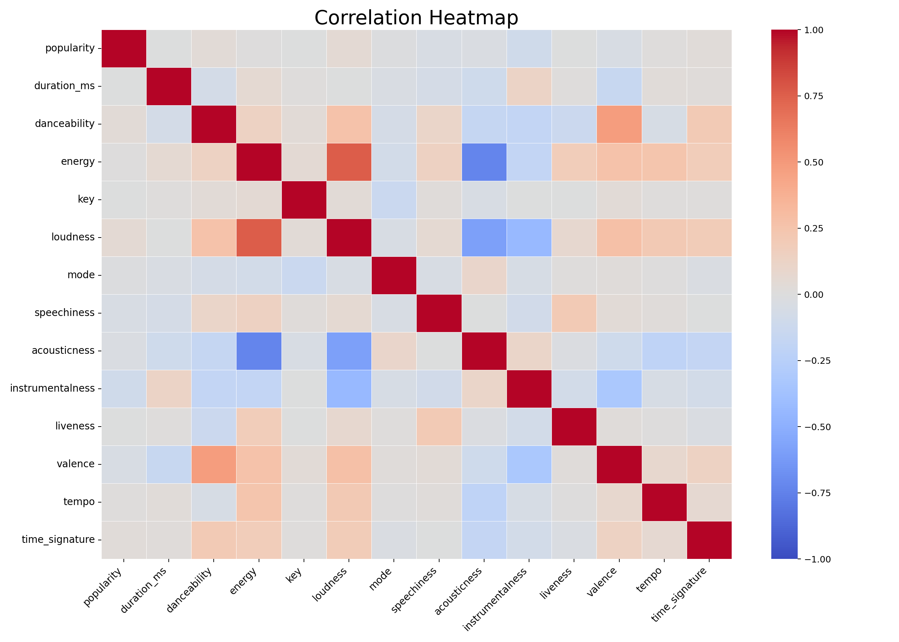

# Spotify Song Popularity Prediction

Bu proje, Spotify şarkı özelliklerini kullanarak şarkı popülerliğini tahmin etmeyi ve bir şarkının "hit" olma olasılığını sınıflandırmayı amaçlayan bir makine öğrenmesi çalışmasıdır.

## Proje Özeti

Projede aşağıdaki adımlar uygulanmıştır:

- Spotify veriseti yükleme ve ön işleme
- Keşifsel veri analizi (EDA)
- Korelasyon analizi ve görselleştirme
- Özellik ölçeklendirme
- PCA ile boyut indirgeme
- K-Means kümeleme
- Linear Regression ile popülerlik tahmini
- Decision Tree Classifier ile hit/normal sınıflandırma
- Yeni bir şarkı için kullanıcıdan özellik girmesiyle tahmin yapma

## Örnek Görsel: Korelasyon Isı Haritası

Aşağıdaki grafik, sayısal özellikler arasındaki korelasyonu gösterir. Her hücre, iki değişkenin birlikte nasıl hareket ettiğini ifade eder:

- Kırmızı tonlar: pozitif korelasyon (bir artarken diğeri de artar)
- Mavi tonlar: negatif korelasyon (bir artarken diğeri azalır)
- Açık / beyaz tonlar: zayıf veya neredeyse hiç ilişki yok
- Ana köşegen (1.0): bir değişkenin kendisiyle korelasyonu, beklenen bir durumdur



Bu görsel, örneğin `energy`, `loudness`, `danceability` gibi özelliklerin birbirleriyle olan ilişkilerini anlamaya yardımcı olur. Böylece model geliştirme aşamasında hangi değişkenlerin birlikte hareket ettiğini görerek daha doğru feature seçimi yapılabilir.

## Kullanılan Veri

Veri seti, `data/spotify-tracks-dataset.csv` dosyasında yer almaktadır. Şarkıların temel özellikleri (danceability, energy, loudness, acousticness, instrumentalness, tempo vb.) üzerinde çalışılır.

## Proje Yapısı

```text
.
├── data/
│   └── spotify-tracks-dataset.csv
├── src/
│   ├── classification.py
│   ├── clustering.py
│   ├── prediction.py
│   ├── preprocess.py
│   ├── regression.py
│   └── visualization.py
├── main.py
├── requirements.txt
├── README.md
└── .gitignore
```

## Ana Modüller

- `main.py`: Veri setini yükler, analiz eder ve makine öğrenmesi adımlarını çalıştırır.
- `src/visualization.py`: Korelasyon ısı haritası ve PCA görselleştirmeleri oluşturur.
- `src/clustering.py`: K-Means kümeleme analizi uygular.
- `src/regression.py`: Linear Regression modelini eğitir ve popülerlik tahmini yapar.
- `src/classification.py`: Hit olma sınıfı için Decision Tree modeli eğitir.
- `src/prediction.py`: Kullanıcıdan yeni şarkı değerleri alıp popülerlik ve hit tahmini yapar.
- `src/preprocess.py`: Veri temizleme ve ön işleme adımlarını içerir.

## Kurulum

1. Sanal ortam oluşturun:

```bash
python -m venv .venv
source .venv/bin/activate
```

2. Gereksinimleri yükleyin:

```bash
pip install -r requirements.txt
```

## Çalıştırma

Projeyi tam olarak çalıştırmak için:

```bash
python main.py
```

Belirli bir bileşeni çalıştırmak isterseniz:

```bash
python src/regression.py
python src/classification.py
python src/clustering.py
python src/prediction.py
```

Not: `main.py` ve bazı modüller, çalıştırıldığında görsel çıktılar açabilir ve terminal üzerinden giriş isteyebilir.

## Kullanılan Teknolojiler

- Python
- Pandas
- NumPy
- Matplotlib
- Seaborn
- scikit-learn

## Sonuç

Bu proje, müzik verileri üzerinde makine öğrenmesi kullanarak şarkının popülerlik eğilimini tahmin etmek ve "hit" olma potansiyelini değerlendirmek için örnek bir veri bilimi uygulamasıdır.
